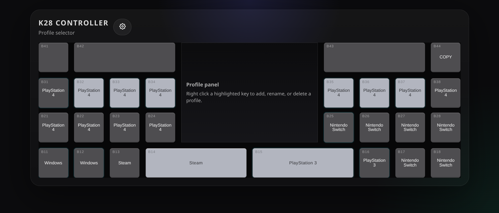

# K28 Studio — Keyboard Controller Profile Manager

A visual reference tool for the **Gamo2 K28** keyboard controller. It lets you document, organize, and preview key binding profiles — all in your browser. No build step, no toolchain — just HTML, CSS, and vanilla JavaScript with IndexedDB for local storage.

> ⚠️ **This is a reference tool only.** It does not interact with the K28 hardware. It's a place to plan, annotate, and keep track of your configs — not a tool to program the device itself.

### Why use it?

The K28 has 24 physical slots across multiple hardware modes (Windows, PS4, Switch, etc.). Switching games or play styles means remapping buttons, and without a visual reference it's easy to lose track of what goes where. K28 Studio gives you a live, interactive view of the controller layout so you can:

- **See every slot at a glance** — which have custom profiles, which use presets, and what mode they belong to
- **Preview and edit bindings** — hover any key to inspect its binding, or toggle edit mode to type changes directly on the keys
- **Copy bindings between profiles** — duplicate a layout to another slot with a couple of clicks
- **Attach notes and images** — write markdown notes and attach reference images (game-specific key maps, combo sheets, etc.) to any profile
- **Backup or share** — export profiles and pages as a single ZIP archive, or export/import bindings for an individual profile

Whether you're planning a tournament layout or maintaining a library of profiles across every mode, everything lives in the browser with no server, no login, and no install.

---

## Architecture

The entire app runs client-side. Profiles, pages, and images are stored in IndexedDB — no server required. Two external libraries are loaded via CDN:

- **[JSZip](https://stuk.github.io/jszip/)** — ZIP archive creation/parsing for import/export
- **[marked](https://marked.js.org/)** — Markdown rendering for page notes

The project also includes a [GitHub Pages deployment workflow](.github/workflows/static.yml) for hosting the app directly.

---

## Features

- **Visual keyboard layout** — Data-driven rendering of the full K28 layout with HTML/CSS (no images)
- **Profile Selector** — View all 24 slots at a glance with mode labels, user-data indicators, and copy/paste support
- **Profile Editor** — Select a profile to see its bindings on the keyboard; hover any key to inspect its binding in the center display
- **Edit Mode** — Click the MACRO key (B44) to toggle inline editing, then type bindings directly onto keys
- **Copy/Paste Bindings** — Click the MACRO key in the selector view, pick a source profile, then paste onto any custom slot
- **Pages** — Attach rich markdown notes with image galleries to any profile. Write in a split-pane editor with live preview
- **Import/Export** — Export all profiles as a `.k28profiles` ZIP archive; import profiles from the same format
- **Binding Import/Export** — Export/import bindings for a single profile as a `.k28binding` JSON file
- **Context menus** — Right-click any slot or key for profile management actions (rename, delete, clear, export)
- **Preset profiles** — 12 factory presets included (Windows, PS4, Switch, Project DIVA, fighting layouts, etc.)
- **Toast notifications** — In-app feedback for save, import, export, and error events

---

## Quick Start

Open `k28/index.html` in your browser.

> The entire `k28/` directory must be preserved — `index.html` loads CSS and JS from sibling folders. Moving just the HTML file somewhere else will break these references.

That's it. No dependencies, no server, no install.

---

## License

MIT
